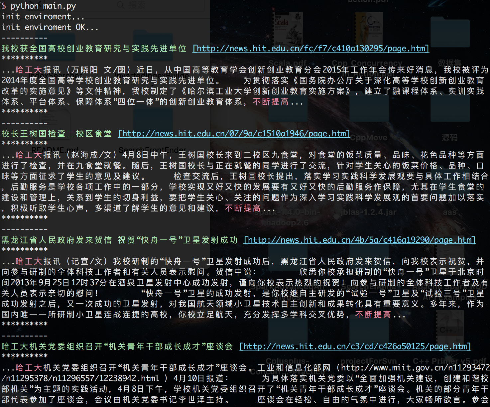

#简易搜索引擎系统V2.0

(与简易搜索引擎系统V1.0的不同在于： 
**<u>倒排索引构建使用了Apache Spark、检索使用了Hash结构</u>**)

###基本概况

- 基于Python实现 
- 面向新闻标题、正文 
- 数据抓取自“今日哈工大”网（因为我砍后台没反爬虫） 
- 新闻数量37251个 
- 闲暇之余写的，没啥太高端的东西，权当理解搜索引擎原理。。。 

###系统架构

###系统代码目录

`DataCrawer`：哈工大新闻抓取模块，基于urllib； 
`DocumentsManager`：新闻文档管理模块，提供根据新闻id获得新闻； 
`SearchFrontEnder`：搜索前端模块，主要接受用户输入，切词->查询倒排索引->取出对应文档->排序->输出； 
`InvertedIndexBuilder`：索引器构建模块，对已爬取文档构建倒排索引，按HASH形式存储； 
`InvertedIndexBuilder/InvertedIndexBuilderWithSpark`：SBT编译环境的Spark应用程序，用于merge、创建总的倒排索引 
`IndexSearcher`：索引器模块，从B树获取词元对应的倒排索引； 
`Utils`：其他函数；如计算词的IDF等。。。

###基本流程
**step1**：进入DataCrawer目录，分别执行：
>python crawlHITnewsUrls.py 进行获取新闻的Urls

>python crawlHITnews.py 对新闻进行爬取、存储

**step2**：进入Documents目录，执行
>python createDocumentDir.py 进行分类存储、方便文档管理器进行管理
**step3**：进入InvertedIndexBuilder目录，执行：
>python createSubInvertedIndex.py 切分词，创建出每个文档的倒排索引：subInvertexIndex.txt； 
>进入子目录：InvertedIndexBuilderWithSpark，这里是Spark应用程序： 
>（1）先将subInvertexIndex.txt上传到Spark集群的HDFS上（本地也行，需要修改代码中的数据路径）； 
>（2）打包程序：sbt assembly； 
>（3）提交到集群运行：spark-submit InvertedIndexBuilder； 
>（4）结果为InvertedIndex文件夹，包含part-00000、part-00001两个文件； 
>（5）合并这两个文件（cat part-00001 >> part-00000）并命名为Inverted Index.txt存放于InvertedIndexBuilder目录下；

**step4**：进入Utils目录，执行：
>python computeIDF.py 为所有词计算IDF，存起来；

**step5**：然后搜索引擎就可以使用了，回到主目录，在main.py文件内写自己要搜索的句子，然后执行：
>python main.py 得到搜索结果，比如搜索**`不断提高 哈工大`**结果如图：

###相关技术

- 利用urllib、beautifulSoup来爬取新闻；
- 利用2-gram进行词元切分，并构建每个文档的倒排索引；
- 利用Apache Spark进行所有倒排索引的merge，关键RDD API：`groupByKey`
- 利用HASH做词典，检索倒排索引；
- 用户输入内容的词元对应索引取交集，获得候选索引；
- 利用词元的TF*IDF判断新闻内容与用户输入的相似度，对候选索引进行排序，然后选出前K个；

###联系作者
Email：`leechan8@outlook.com`
